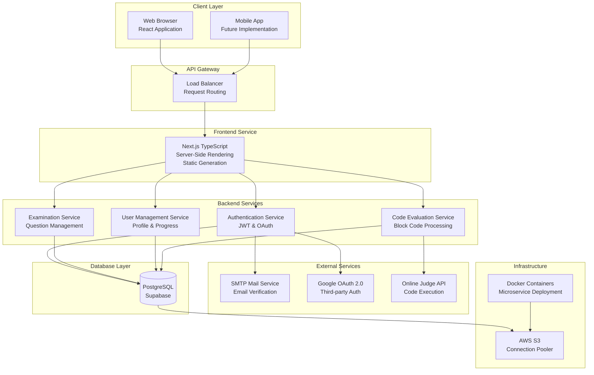
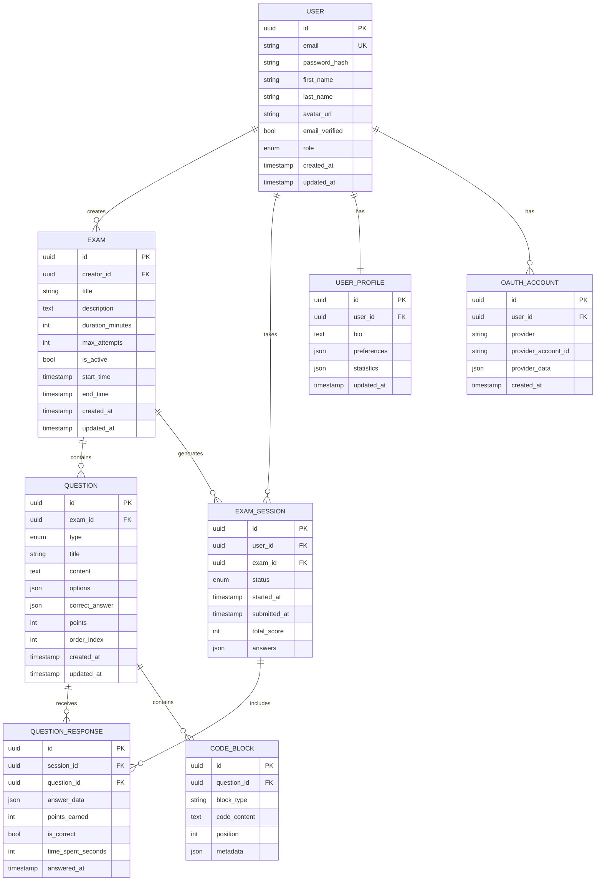

# Web Programming Final Project Documentation
## Quzuu - Interactive Online Examination Platform

---

### 📋 Executive Summary

**Quzuu** is an innovative interactive online examination platform designed to revolutionize the way educational assessments are conducted. The platform addresses the growing need for diverse, engaging, and technologically advanced examination systems in modern education. By implementing a comprehensive microservice architecture and incorporating cutting-edge features like Block Code Puzzles, Quzuu provides an unparalleled examination experience that goes beyond traditional multiple-choice questions.

### 🎯 Project Overview

#### Problem Statement
Traditional online examination platforms often lack variety in question types and fail to engage students effectively, particularly in technical subjects like programming. Most existing platforms are limited to basic question formats and don't provide interactive elements that can properly assess practical skills.

#### Solution
Quzuu introduces a comprehensive examination platform featuring:
- Eight distinct question types including innovative Block Code Puzzles
- Interactive drag-and-drop programming interfaces
- Integration with automated code evaluation systems
- Modern microservice architecture for scalability
- Advanced authentication and security features

#### Key Innovation: Block Code Puzzle
The standout feature of Quzuu is the **Block Code Puzzle** system, which allows students to:
- Drag and drop code blocks to complete programs
- Fill in missing syntax through interactive typing
- Visualize program structure through block-based interfaces
- Receive real-time feedback on code construction

### 🏗️ System Architecture

#### Microservice Architecture Overview


#### Technology Stack

**Frontend Technologies:**
- **Next.js 14** with TypeScript for type safety
- **React 18** with hooks and context API
- **Tailwind CSS** for responsive design
- **React DnD** for drag-and-drop functionality
- **Axios** for HTTP client communications

**Backend Technologies:**
- **Go 1.21** with Gin framework for high performance
- **GORM** as Object-Relational Mapping tool
- **JWT-Go** for token-based authentication
- **Google OAuth 2.0** for external authentication

**Database & Storage:**
- **PostgreSQL 15** as primary database
- **Supabase** for database hosting and management
- **AWS S3** for connection pooling and file storage

### 📊 Detailed Feature Specifications

#### 1. Question Type System


#### 2. Block Code Puzzle Implementation
The Block Code Puzzle system represents the most innovative aspect of Quzuu:

**Technical Implementation:**
- **Drag & Drop Engine**: Built using React DnD library with custom drop zones
- **Code Block Rendering**: SVG-based visual representation of code blocks
- **Syntax Validation**: Real-time syntax checking as blocks are arranged
- **Execution Engine**: Server-side code compilation and execution for validation

**User Interaction Flow:**


### 🔐 Authentication & Security System

#### Google OAuth 2.0 Integration
Quzuu implements Google OAuth 2.0 as the primary external authentication method, providing users with a seamless login experience using their Google accounts.


#### Google OAuth Implementation Details
**Frontend Implementation (Next.js):**
```typescript
// Google OAuth Configuration
const googleAuth = {
  clientId: process.env.NEXT_PUBLIC_GOOGLE_CLIENT_ID,
  redirectUri: process.env.NEXT_PUBLIC_GOOGLE_REDIRECT_URI,
  scope: 'openid email profile'
};

// OAuth Login Handler
const handleGoogleLogin = async () => {
  const authUrl = `https://accounts.google.com/oauth/authorize?` +
    `client_id=${googleAuth.clientId}&` +
    `redirect_uri=${googleAuth.redirectUri}&` +
    `response_type=code&` +
    `scope=${googleAuth.scope}`;
  
  window.location.href = authUrl;
};
```

**Backend Implementation (Go):**
```go
// Google OAuth Token Exchange
func (s *AuthService) GoogleOAuthCallback(code string) (*models.User, string, error) {
    // Exchange authorization code for tokens
    token, err := s.googleOAuthConfig.Exchange(context.Background(), code)
    if err != nil {
        return nil, "", err
    }
    
    // Extract user info from ID token
    idToken := token.Extra("id_token").(string)
    claims, err := s.validateGoogleIDToken(idToken)
    if err != nil {
        return nil, "", err
    }
    
    // Create or update user account
    user, err := s.findOrCreateGoogleUser(claims)
    if err != nil {
        return nil, "", err
    }
    
    // Generate JWT token
    jwtToken, err := s.generateJWT(user)
    return user, jwtToken, err
}
```

#### Multi-layered Authentication


#### Google OAuth User Data Flow

```mermaid
graph LR
    subgraph "Google OAuth Claims"
        GOOGLE_USER[Google User Data<br/>• Email<br/>• Name<br/>• Picture<br/>• Email Verified<br/>• Google ID]
    end
    
    subgraph "Backend Processing"
        VALIDATE[Validate ID Token<br/>• Signature Verification<br/>• Expiration Check<br/>• Audience Validation]
        EXTRACT[Extract Claims<br/>• Email<br/>• First Name<br/>• Last Name<br/>• Profile Picture<br/>• Google Sub ID]
        MAP[Map to User Model<br/>• Create User Entity<br/>• Set Email Verified<br/>• Link OAuth Account]
    end
    
    subgraph "Database Storage"
        USER_TABLE[(Users Table<br/>• Standard User Fields<br/>• Email Pre-verified)]
        OAUTH_TABLE[(OAuth Accounts<br/>• Provider: Google<br/>• Provider Account ID<br/>• Linked User ID)]
    end
    
    GOOGLE_USER --> VALIDATE
    VALIDATE --> EXTRACT
    EXTRACT --> MAP
    MAP --> USER_TABLE
    MAP --> OAUTH_TABLE
```


#### Security Features Implementation
1. **JWT Token System**
   - Access tokens with configurable expiration
   - Secure token storage using httpOnly cookies
   - Token validation middleware for protected routes

2. **Email Verification System**
   - SMTP integration for email delivery
   - Time-limited verification tokens
   - Account activation workflow

3. **Google OAuth 2.0 Integration**
   - Complete OAuth 2.0 flow implementation
   - ID token validation with Google's public keys
   - Automatic user account creation and linking
   - Profile data synchronization

4. **Password Security**
   - Bcrypt hashing for password storage
   - Password strength validation
   - Secure password reset functionality

### 💾 Database Design & Management

#### Entity Relationship Diagram


#### Database Operations & GORM Implementation

**CRUD Operations Implementation:**
```go
// User Repository Pattern
type UserRepository interface {
    Create(user *models.User) error
    GetByID(id uuid.UUID) (*models.User, error)
    GetByEmail(email string) (*models.User, error)
    Update(user *models.User) error
    Delete(id uuid.UUID) error
    List(filters map[string]interface{}) ([]*models.User, error)
}

// GORM Implementation
type userRepository struct {
    db *gorm.DB
}

func (r *userRepository) Create(user *models.User) error {
    return r.db.Create(user).Error
}

func (r *userRepository) GetByEmail(email string) (*models.User, error) {
    var user models.User
    err := r.db.Where("email = ?", email).First(&user).Error
    return &user, err
}
```

**Auto Migration System:**
```go
func AutoMigrate(db *gorm.DB) error {
    return db.AutoMigrate(
        &models.User{},
        &models.Exam{},
        &models.Question{},
        &models.ExamSession{},
        &models.QuestionResponse{},
        &models.CodeBlock{},
        &models.UserProfile{},
        &models.OAuthAccount{},
    )
}
```

### 📱 Frontend Architecture & Implementation

#### Component Architecture


#### React Context Implementation
```typescript
// Authentication Context
interface AuthContextType {
  user: User | null;
  login: (credentials: LoginCredentials) => Promise<void>;
  logout: () => void;
  loading: boolean;
  error: string | null;
}

export const AuthContext = createContext<AuthContextType | undefined>(undefined);

// Exam Context
interface ExamContextType {
  currentExam: Exam | null;
  currentQuestion: Question | null;
  answers: Map<string, any>;
  timeRemaining: number;
  submitAnswer: (questionId: string, answer: any) => void;
  nextQuestion: () => void;
  previousQuestion: () => void;
  submitExam: () => Promise<void>;
}
```

### 🚀 DevOps & Deployment Strategy

#### CI/CD Pipeline Architecture


#### Deployment Configuration

**Docker Configuration for Backend:**
```dockerfile
# Multi-stage Docker build
FROM golang:1.21-alpine AS builder
WORKDIR /app
COPY go.mod go.sum ./
RUN go mod download
COPY . .
RUN CGO_ENABLED=0 GOOS=linux go build -o main ./cmd/server

FROM alpine:latest
RUN apk --no-cache add ca-certificates
WORKDIR /root/
COPY --from=builder /app/main .
COPY --from=builder /app/configs ./configs
EXPOSE 8080
CMD ["./main"]
```

**GitHub Actions Workflow:**
```yaml
name: Deploy Quzuu Platform

on:
  push:
    branches: [ main ]

jobs:
  build-frontend:
    runs-on: ubuntu-latest
    steps:
      - uses: actions/checkout@v3
      - uses: actions/setup-node@v3
        with:
          node-version: '18'
      - run: npm ci
      - run: npm run build

  build-backend:
    runs-on: ubuntu-latest
    steps:
      - uses: actions/checkout@v3
      - uses: actions/setup-go@v3
        with:
          go-version: '1.21'
      - run: go mod download
      - run: go build -o main ./cmd/server

  deploy-backend:
    needs: [build-backend]
    runs-on: ubuntu-latest
    steps:
      - uses: actions/checkout@v3
      - name: Build and Push Docker to Hugging Face
        run: |
          docker build -t quzuu-backend .
          # Push repository to Hugging Face Spaces

  deploy-frontend:
    needs: [build-frontend]
    runs-on: ubuntu-latest
    steps:
      - uses: actions/checkout@v3
      - name: Deploy to Vercel
        uses: amondnet/vercel-action@v20
        with:
          vercel-token: ${{ secrets.VERCEL_TOKEN }}
          vercel-org-id: ${{ secrets.VERCEL_ORG_ID }}
          vercel-project-id: ${{ secrets.VERCEL_PROJECT_ID }}
```

### 📊 Project Implementation Summary

#### Technical Implementation
- **Architecture**: Successfully implemented microservice architecture with Next.js frontend and Go backend
- **Database**: PostgreSQL with Supabase hosting and GORM for database operations
- **Authentication**: JWT tokens with Google OAuth 2.0 and email verification
- **Deployment**: Automated CI/CD with GitHub Actions to Hugging Face (backend) and Vercel (frontend)

#### Key Features Achieved
- **Diverse Question Types**: 8 different question formats including innovative Block Code Puzzles
- **Interactive Programming Assessment**: Drag-and-drop code block interface
- **Secure Authentication**: Multi-method login with OAuth integration
- **Automated Deployment**: Push-to-deploy workflow with Docker containerization

### 🎓 Academic Learning Outcomes

#### Web Programming Course Integration
This project successfully demonstrates the application of key web programming concepts taught in the course:

**1. Full-Stack Development**
- Frontend-backend separation with clear API boundaries
- RESTful API design principles
- Asynchronous programming patterns

**2. Database Management**
- Relational database design and normalization
- CRUD operations implementation
- ORM usage and best practices
- Database migration and version control

**3. Authentication & Authorization**
- Session management and security
- OAuth 2.0 implementation
- JWT token-based authentication
- Multi-factor authentication concepts

**4. Modern Web Technologies**
- TypeScript for type safety
- React hooks and context API
- Server-side rendering with Next.js
- Go microservice architecture

**5. DevOps & Deployment**
- Containerization with Docker
- CI/CD pipeline implementation
- Cloud platform deployment
- Automated testing and quality assurance

#### Innovation Beyond Curriculum
The Block Code Puzzle feature represents an innovative extension beyond traditional web programming coursework, demonstrating advanced user interface design and educational technology integration.

### 📈 Project Outcomes

#### Educational Learning Objectives Achieved
- **Full-Stack Development**: Complete frontend-backend integration
- **Database Management**: CRUD operations with ORM and auto-migration
- **Modern Authentication**: JWT and OAuth 2.0 implementation
- **DevOps Practices**: CI/CD pipeline with Docker containerization
- **API Development**: RESTful API design and implementation

### 📝 Conclusion

The Quzuu Interactive Online Examination Platform successfully demonstrates the practical application of web programming concepts learned throughout the course. The project integrates modern technologies including Next.js with TypeScript for the frontend, Go with Gin framework for the backend, and PostgreSQL with Supabase for data management.

Key achievements include implementing a comprehensive microservice architecture, creating an innovative Block Code Puzzle system for programming assessments, establishing secure authentication with both email verification and Google OAuth 2.0, and deploying the application using automated CI/CD pipelines with GitHub Actions.

The platform's standout Block Code Puzzle feature showcases the potential for interactive educational technology, providing students with hands-on programming assessment tools that go beyond traditional multiple-choice questions. Through its modular architecture and automated deployment system, Quzuu represents a production-ready educational platform that successfully fulfills the requirements of the web programming final project while demonstrating mastery of full-stack development principles.
